Authentication API
==================
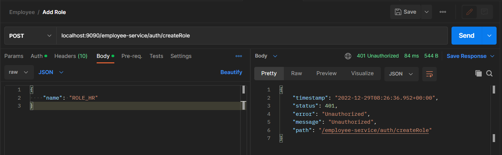

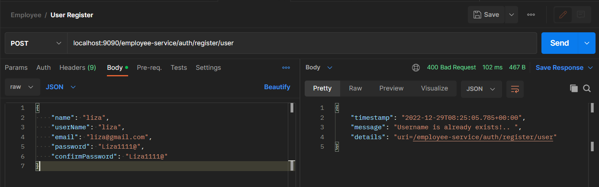
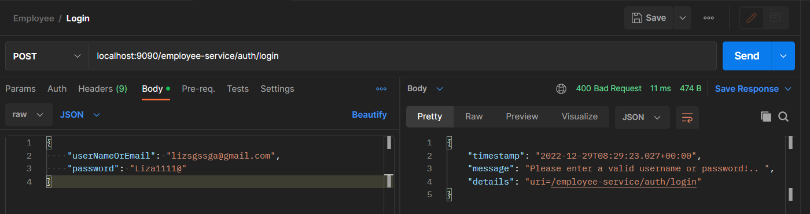
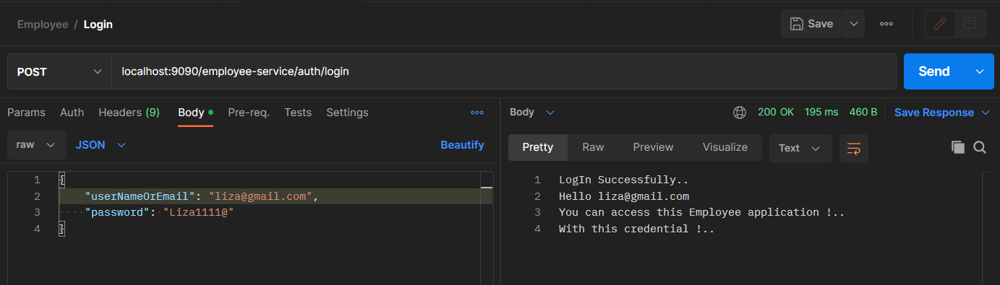
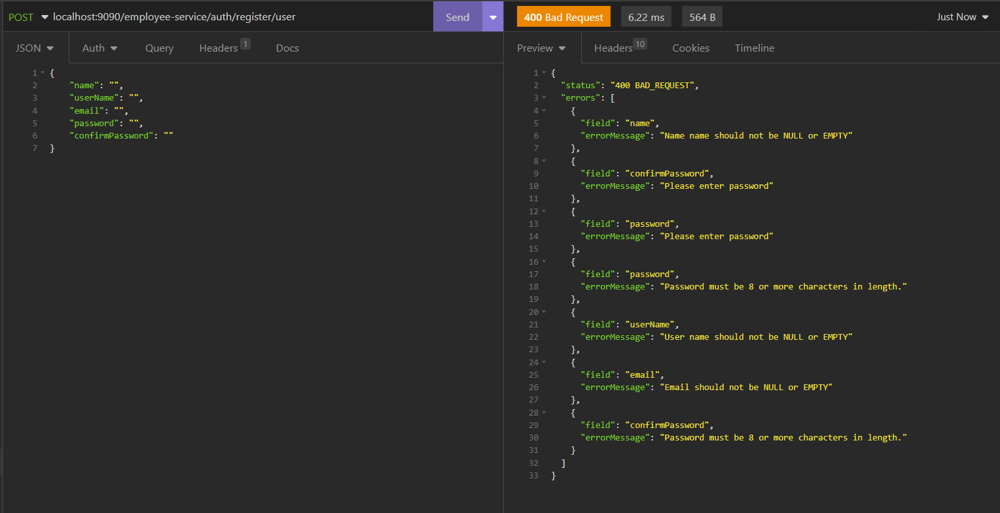
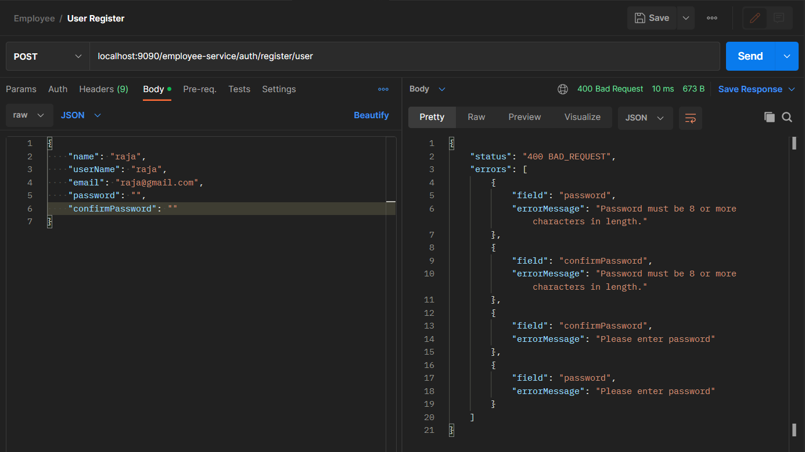
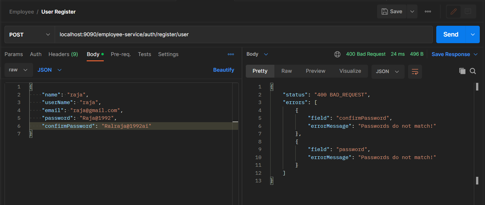
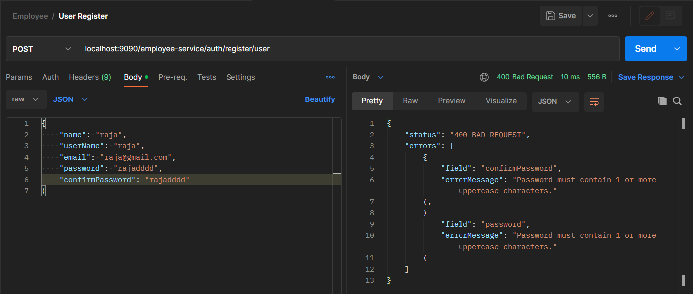

App API with authentication (ROLE_USER or ROLE_ADMIN credential mandatory)
==========================================================================
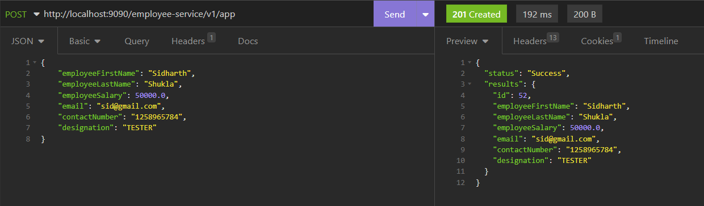
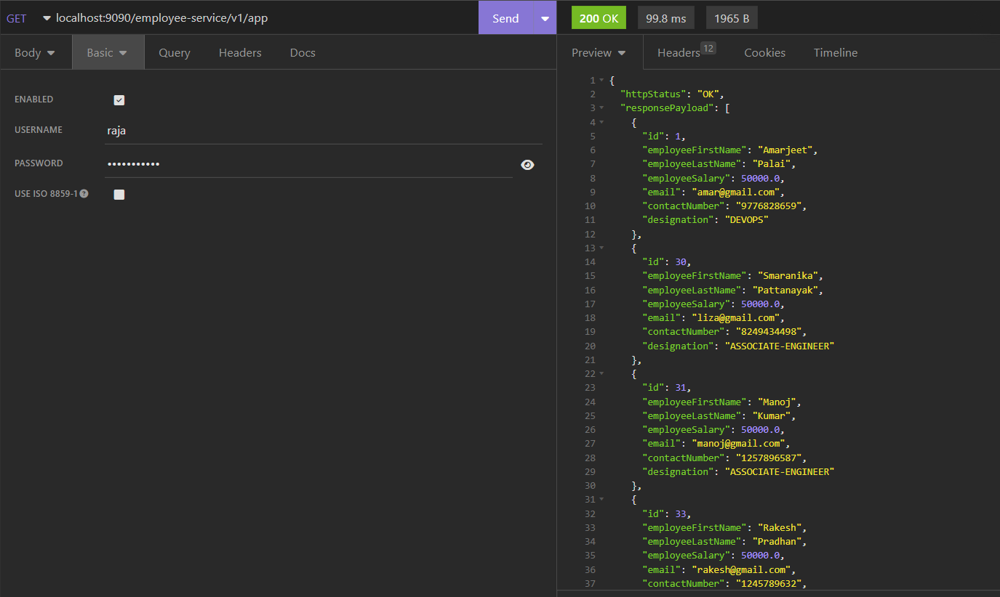
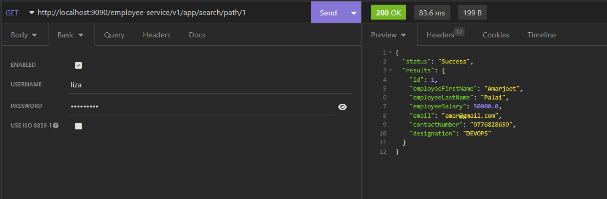
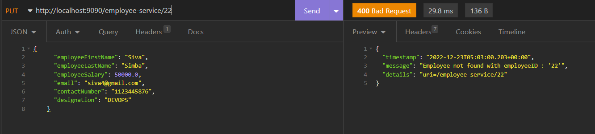
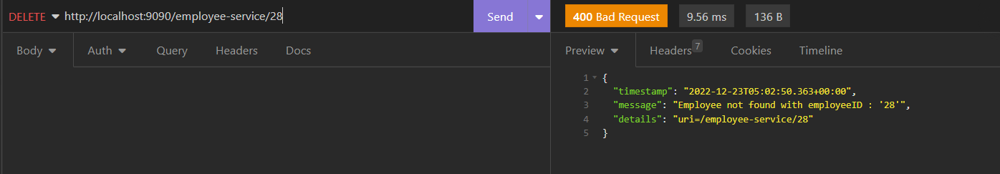

SWAGGER
========
http://localhost:9090/swagger-ui/index.html
-------------------------------------------------
POST
====
http://localhost:9090/employee-service

body => {
"employeeFirstName": "string",
"employeeLastName": "string",
"employeeSalary": 300000,
"email": "string",
"contactNumber": "1409115369",
"designation": "string"
}
----------------------------------------

GET
===
http://localhost:9090/employee-service

------------------------------------

GET BY ID
==========
http://localhost:9090/employee-service/search/path/{employeeId}

---------------------------------------------------------------------

GET BY ID REQUEST PARAM
==========================
http://localhost:9090/employee-service/search/request?employeeId=1

----------------------------------------------------------------------

GET DATA BY DESIGNATION
========================
http://localhost:9090/employee-service/designationTypes

---------------------------------------------------------

DELETE DATA
==============

